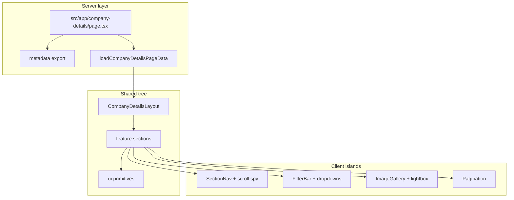

# Company Details Page — implementation plan (Phases 0–6)

## Repo reality vs spec

| Spec mention                     | In [company-details](file:///Users/mindpath/company-details)                                                                                                                                                                                                                       |
| -------------------------------- | ---------------------------------------------------------------------------------------------------------------------------------------------------------------------------------------------------------------------------------------------------------------------------------- |
| `app/company-details/page.tsx`   | Use **[src/app/company-details/page.tsx](src/app/company-details/page.tsx)** — App Router already lives under `src/app/` ([tsconfig paths](tsconfig.json) `@/`_ → `./src/`_).                                                                                                      |
| `tailwind.config` `theme.extend` | **Tailwind v4** ([package.json](package.json)): theme tokens belong in **[src/app/globals.css](src/app/globals.css)** via `@theme inline { ... }` and `:root` CSS variables. Optionally add `tailwind.config.ts` later for plugins only; avoid duplicating token sources.          |
| ESLint / Prettier                | ESLint exists ([eslint.config.mjs](eslint.config.mjs): `eslint-config-next` vitals + TS). Add **Prettier** + format script if you want parity with the doc; add **explicit jsx-a11y** rules only if the flat preset does not already cover your bar (verify after first lint run). |

No README exists yet — create **[README.md](README.md)** (or extend if one appears) with a **“Planned post–v1”** subsection: Phase 7 (perf/Lighthouse/axe, `next/image` sizes, `dynamic()` splitting, heading audit), Phase 8 (error boundaries, `loading.tsx`/`error.tsx`, optional E2E), plus **Zod in loader**, URL sync (nuqs), CMS adapter, JSON-LD.

---

## Architecture (unchanged intent)

- **Thin route**: [src/app/company-details/page.tsx](src/app/company-details/page.tsx) composes metadata + `loadCompanyDetailsPageData()` + `CompanyDetailsLayout` + section tree; no business logic in the route file beyond wiring.
- **Data boundary**: Static JSON in [src/features/company-details/data/company-details.mock.json](src/features/company-details/data/company-details.mock.json); adapter [src/features/company-details/data/load-company-details-page.ts](src/features/company-details/data/load-company-details-page.ts) returns `CompanyDetailsPageData` ([src/features/company-details/types/company-details-page.ts](src/features/company-details/types/company-details-page.ts)). Sections consume typed props only.
- **Client boundaries**: Default Server Components; `'use client'` only on filters, gallery/lightbox, section nav (scroll spy), mobile overflow menus, pagination controls.
- **Optional route group**: [src/app/(marketing)/](src/app/(marketing)/) + shared `layout.tsx` is **optional** for v1. Prefer **[src/app/company-details/page.tsx](src/app/company-details/page.tsx)** first; introduce `(marketing)` only when a second page needs identical chrome (avoids maintaining two trees).

---

## Phase 0 — Foundation

1. **Figma tokens (when MCP/design is available)**
  Extract spacing, radii, typography, colors, elevations, z-index → map **once** into `globals.css`: extend `:root` / `@theme inline` with semantic names (e.g. `--color-surface`, `--radius-card`). Document one-offs in a short comment block or `src/styles/README` only if you must — user asked to avoid extra markdown unless needed; inline in `globals.css` is enough for v1.
2. **Tooling**

- Add `clsx` + `tailwind-merge` and [src/lib/cn.ts](src/lib/cn.ts).
- Add [src/lib/assert.ts](src/lib/assert.ts) only if you use narrow assertions at the JSON boundary.
- Prettier: add config + `format` script if required by team standards.

1. **Base UI primitives** under [src/components/ui/](src/components/ui/)
  Start minimal set needed by Phases 3–6: `Button`, `Input`, `Checkbox`, `Dropdown` (or headless primitive + styled shell), `Modal`, `Pagination`, `Tooltip`, `Card`, `Tabs`, `Skeleton`, `Icon` (or lucide-react if you accept one icon dep). Match token names from step 1.
2. **Hooks** under [src/hooks/](src/hooks/): `use-media-query.ts`, `use-lock-body-scroll.ts`, `use-reduced-motion.ts`, `use-intersection-observer.ts` (scroll spy + lazy patterns).
3. **Site config** [src/config/site.ts](src/config/site.ts) for product name “Company Details Page”, nav labels, `header-offset` CSS variable consumed by sticky sidebar / `scroll-margin-top`.

**Strict TS**: already `strict: true` in [tsconfig.json](tsconfig.json); keep `noImplicitAny` path clean as features land.

---

## Phase 1 — Layout shell

- **Global chrome** in [src/components/layout/](src/components/layout/): `top-header/`, `main-header/`, `footer/` — implement structure + responsive behavior; can use placeholder links until IA is final.
- **Feature layout** [src/features/company-details/components/company-details-layout.tsx](src/features/company-details/components/company-details-layout.tsx): main column + sticky right sidebar; stack on small breakpoints; `position: sticky` with `top: var(--header-offset)` (set in layout or globals).
- **Sidebar**: colocate under `components/layout/company-details-sidebar/` **or** under feature if not reused — default to **feature** (`sticky-sidebar/`) unless a second route needs the same sidebar.

---

## Phase 2 — Page skeleton

- Add [src/app/company-details/page.tsx](src/app/company-details/page.tsx) with `export const metadata` (title/description for “Company Details Page”).
- Implement loader + types + empty/placeholder section components wired with `CompanyDetailsPageData`.
- **Scroll registry**: [src/features/company-details/lib/scroll-registry.ts](src/features/company-details/lib/scroll-registry.ts) — single map of section ids → labels; used by section nav and `scroll-margin-top` on section wrappers.
- **Filter state placeholder**: [src/features/company-details/lib/filter-state.ts](src/features/company-details/lib/filter-state.ts) — client state only v1; document extension point for nuqs (comment or types only).

---

## Phase 3 — Hero + section nav

- **Banner** (+ stats) under `features/company-details/components/banner/`.
- Smooth scroll to ids from `scroll-registry`; **respect `prefers-reduced-motion`** ([use-reduced-motion](src/hooks/use-reduced-motion.ts)) — instant jump when reduced motion.
- Landmarks: ensure `header` / `nav` / `main` / `footer` composition in layout + page.

---

## Phase 4 — Interactive core

- **Filters**: `FilterBar`, multi-select, dropdowns using ui primitives; all client components; operate on mock list data from `CompanyDetailsPageData`.
- **Pagination**: client-controlled slice of filtered list; keyboard-friendly controls.

---

## Phase 5 — Gallery + modal

- **Grid** + **lightbox** with focus trap, Escape to close, arrow keys between images, `use-lock-body-scroll`.
- `**next/image` for gallery assets where files exist (baseline perf per your doc; deep LCP tuning = post–v1).

---

## Phase 6 — Remaining sections

- Implement under `features/company-details/components/`: `company-score/`, `comparison/`, `payment-strip/`, `disclaimer/`, `newsletter/`, `reviews/` (and nested `review-card/` if needed).
- **Payment strip / newsletter**: keep forms non-destructive (no real submit in v1 unless spec requires).

---

## Accessibility & SEO (v1 bar, not Lighthouse gate)

- One `**<h1>`** on the page; logical **h2/h3 per section.
- Visible focus styles on interactive controls; modal focus return.
- **JSON-LD**: omit in v1 unless content is stable; note in README as post–v1 optional.

---

## Out of scope (explicit)

Phases **7–8**, formal Lighthouse/axe CI gate, `loading.tsx`/`error.tsx` polish, Zod in loader, URL sync — listed only under **README “Planned post–v1”**.

---

## Scaling note

Future routes: add `src/features/<feature>/`; keep [src/components/ui/](src/components/ui/) and [src/components/layout/](src/components/layout/) stable. If public URL shortens to `/company`, **one** redirect or route move — no duplicate feature trees.